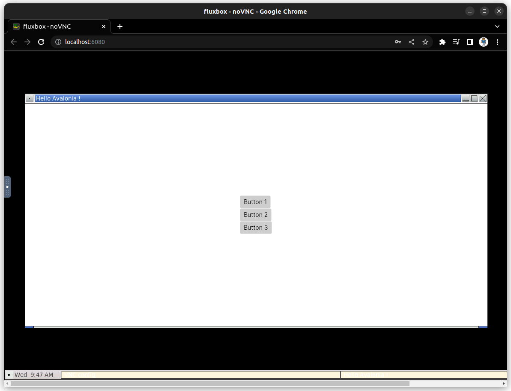
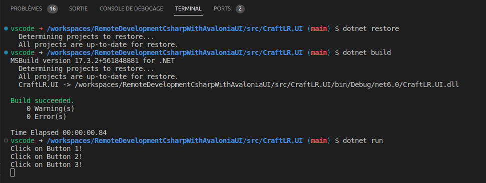

#  

## La Rochelle Software Craftsmenship

* **Auteurs:**

  * [Sébastien NEDJAR](mailto:sebastien.nedjar@univ-amu.fr)

* **Besoin d'aide ?**

  * Consulter et/ou créer des [issues](https://github.com/CraftLR/RemoteDevelopmentCsharpWithAvaloniaUI/issues).
  * [Email](mailto:sebastien.nedjar@univ-amu.fr) pour toutes questions autres.

## Aperçu du tutoriel et objectifs d'apprentissage

Commencer à écrire du code demande souvent de disposer d'un environnement de développement particulier avec des contraintes bien spécifique concernant les logiciels disponibles ainsi que leurs versions. Développer avec un environnement assez portable pour ne plus avoir à se préoccuper ni de la machine que l'on utilise ni de sa configuration permet de gagner un temps précieux et de se concentrer sur l'essentiel, c'est-à-dire produire le code qui répondra au mieux aux besoins de l'utilisateur. 

Avec la démocratisation des conteneurs et leur meilleure intégration dans les différents outils, il est maintenant possible de disposer de tels environnements de développement assez facilement. L'objectif de ce tutoriel est de vous faire découvrir comment mettre en place ces conteneurs de développement et surtout comment les utiliser de manière quasi-transparente avec un IDE.

La technologie présentée est celle des [Dev Container](https://code.visualstudio.com/docs/devcontainers/containers) originellement développée pour [Visual Studio Code](https://code.visualstudio.com/docs/) mais qui est aujourd’hui disponible pour les IDE JetBrains à travers l'application [JetBrains Gateway](https://www.jetbrains.com/fr-fr/remote-development/gateway/).

Pour gagner encore plus en souplesse et en rapidité, il est possible de lancer le conteneur de développement sur une machine distante en utilisant des outils tels que [Github Codespaces](https://github.com/features/codespaces) ou [Gitpod](https://www.gitpod.io/).

Ce dépôt contient la configuration minimale nécessaire pour créer un projet disposant d'une interface homme machine basée sur la bibliothèque [AvaloniaUI](https://avaloniaui.net/). Il peut être utilisé avec un IDE en ligne comme avec un IDE local.

## Conteneur de développement pour applications graphiques

Un conteneur de développement permet d'abstraire les dépendances et les outils d'un projet via l'utilisation de [Docker](https://www.docker.com/). Le pack d'extension [Remote Development](https://marketplace.visualstudio.com/items?itemName=ms-vscode-remote.vscode-remote-extensionpack) de VS Code permet à l'IDE d'interagir directement avec le conteneur. Cela réduit considérablement le temps de démarrage d'un nouveau développeur, tout en réduisant le risque d'installations incorrectes ou de blocage lors de l'installation.

Un conteneur de développement est défini par un fichier `devcontainer.json` qui doit se trouver dans le dossier `.devcontainer` à la racine du projet. Dans ce fichier, sont définis les services requis, ainsi que la configuration spécifique de l'application. Une fois le conteneur construit, VS Code peut travailler directement à l'intérieur du conteneur, comme si vous développiez localement. 

Il y a beaucoup à savoir sur les Dev Container, mais le moyen le plus simple de démarrer est de tester sur un projet déjà configuré.

La première chose à faire est de créer un fork de ce dépôt. Pour ce faire, rendez-vous sur le lien suivant :

<https://classroom.github.com/a/ODs1X7VB>

GitHub va vous créer un dépôt contenant un fork de ce dépôt. Vous apparaîtrez automatiquement comme contributeur de ce projet pour y pousser votre travail. Clonez localement votre fork et ouvrez le avec Visual Studio Code.

### Lancement de l'application graphique d'exemple
Pour commencer à tester AvaloniaUI, deux applications très simples sont présente dans le présent dépôt git. La première est juste une fenêtre avec 3 boutons pour illustrer les concepts de base d'AvaloniaUI. Elle s'appelle `CraftLR.UI` et se trouve dans le dossier `src/CraftLR.UI`.

Pour pouvoir la tester, ouvrir un terminal (avec le raccourci clavier  <kbd>Ctrl/Cmd</kbd>+<kbd>Shift</kbd>+<kbd>²</kbd>) et tapez les commandes suivantes : 
```sh
cd src/CraftLR.UI
dotnet restore
dotnet build
dotnet run
```
Les deux premières commandes préparent le projet et le compile. La dernière permet de l'executer. Le programme étant graphique, la commande vous rendra la main que lorsque vous aurez fermer la fenêtre. Actuellement, la fenêtre est lancée dans le conteneur, pour la voir, il faut pouvoir accéder à l'environnement graphique. Dans la prochaine étape vous allez découvrir comment voir la fenêtre de l'application graphique.

### Connexion au bureau du conteneur

Pour lancer une application graphique, il faut disposer dans le conteneur de développement d'un environnement graphique (un serveur X) ainsi que d'un gestionnaire de fenêtrage. Pour éviter le gaspillage de ressource, il faut utiliser le gestionnaire le plus léger possible. C'est pour cela que l'on utilisera [Fluxbox](http://fluxbox.org/). Pour rendre visible l’environnement graphique, on utilisera une version de VNC appelé noVNC qui fonctionne directement dans un navigateur.

Pour ouvrir, noVNC et voir les applications graphiques en cours d'exécution, ouvrez la vue `Ports` et cliquez sur l’icône globe à coté de l'adresse locale `localhost:6080`. Entrez le mot de passe `vscode` et validez.

Si votre application graphique utilise la console, les messages s'afficheront directement dans le terminal dans lequel vous avez lancé votre application.

Si vous avez lancé la commande `dotnet run` dans le dossier du projet `CraftLR.UI`, vous devriez avoir l'affichage suivant :



La fenêtre est bien visible et si vous interagissez avec les boutons, les messages s'affichent bien dans le terminal dans lequel le programme a été lancé :



Pour terminer l'application graphique, il suffit de la fermer normalement dans la session noVNC.


